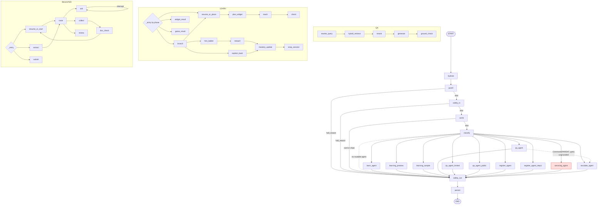

# A0 — Graph inventory (as built, not as documented)

> **Provenance.** Read against a dirty tree (17 modified + 6 new vs HEAD `c0f9d62`).
> The LEARN subgraph's `plan_widget`/`teach` nodes come from `app/agents/learn/teach.py`, which
> **does not exist at HEAD**; `learn/graph.py` and `access.py` are also modified. The main
> graph, QA and REGISTER subgraphs, and the checkpointer are HEAD-clean, verified per file.
> See `FINDINGS-addendum.md`.

Assembly: `backend/app/graph/main_graph.py:362` (`build_main_graph`), compiled at
`main_graph.py:412`. Built **per request** (`stream.py:233`) so `hydrate` can close over
the bearer token.

## Node table — main graph

| Node | file:line | Kind | LLM (model id) | Tools bound |
|---|---|---|---|---|
| `hydrate` | `nodes/hydrate.py` via `main_graph.py:381` | node | none | none |
| `guard` | `nodes/guard.py` via `main_graph.py:382` | node | none | none |
| `safety_in` | `nodes/safety_in.py` via `main_graph.py:383` | node | none | none |
| `cards` | `nodes/cards.py:make_intent_gate` via `main_graph.py:384` | node | none | none |
| `classify` | `nodes/classify.py:372` via `main_graph.py:385` | node | `openai:gpt-4o` (`classifier_model`, resolved `classify.py:249`) | none |
| `safety_out` | `nodes/safety_out.py` via `main_graph.py:386` | node | re-prompt only, `chat_model` (`stream.py:463`) | none |
| `persist` | `main_graph.py:182` | node | optional summariser | none |
| `learn_agent` / `learning_preview` / `learning_sample` | `agents/learn/graph.py:684` | **compiled subgraph** (×3 names, one graph, `graph.py:834`) | `openai:gpt-5.6-luna` (`_teach_invoke`, `learn/graph.py:784`) + `gpt-4o` planner (`graph.py:818`) | none bound; games are nodes |
| `qa_agent` / `qa_agent_limited` / `qa_agent_public` | `agents/qa/graph.py:51` | **compiled subgraph** (×3 names, one graph, `qa/graph.py:232`) | `gpt-5.6-luna` generate (`qa/graph.py:184`), `gpt-4o` rewrite (`qa/graph.py:200`) | none bound at runtime; `qa/tools.py` defines tools not wired into this subgraph |
| `register_agent` / `register_agent_step1` | `agents/register/graph.py:655` | **compiled subgraph** (×2, different `allow_sensitive`, `graph.py:769-772`) | `doc_check` vision model (`DOC_CHECK_MODEL`) | none |
| `escalate_agent` | `agents/escalate/graph.py:378` | **compiled subgraph** | **none — no model call anywhere in the file** | none |
| `servicing_agent` | — | **STUB** (`main_graph.py:82`, no builder registered) | none | none |

`servicing_agent` is granted by `_ORION_16_18` and `_AURORA` (`access.py:139,153`) and is
a stub: it replies `[servicing_agent is not built yet.]`.

## Edge table — main graph

| Source | Destination(s) | Conditional? | Predicate | file:line |
|---|---|---|---|---|
| START | `hydrate` | no | — | `main_graph.py:399` |
| `hydrate` | `guard` | no | — | `main_graph.py:400` |
| `guard` | `safety_in`, `safety_out` | yes | `_after_guard` | `main_graph.py:313,401` |
| `safety_in` | `cards`, `safety_out` | yes | `_after_safety_in` | `main_graph.py:324,402` |
| `cards` | `classify`, `safety_out` | yes | `_after_cards` | `main_graph.py:328,403` |
| `classify` | all 10 agent names, `safety_out` | yes | `_to_agent` | `main_graph.py:347,404` |
| each agent | `safety_out` | no | — | `main_graph.py:406-407` |
| `safety_out` | `persist` | no | — | `main_graph.py:409` |
| `persist` | END | no | — | `main_graph.py:410` |

Out-of-band: every agent node declares `destinations=("escalate_agent","register_agent",
"safety_out")` (`main_graph.py:396`), permitting `Command(goto=…)` handoffs that bypass the
edge table. `qa/nodes.py:1019` uses `Command(graph=PARENT, goto="escalate_agent")`.

## State schema — `AspireState` (`graph/state.py:222`)

| Field | Type | Written by | Read by |
|---|---|---|---|
| `session_id` | str | `hydrate` | logging, escalate |
| `user_id` | str\|None | `hydrate` | `access`, `learn._learner` |
| `device_id` | str | `hydrate` | — **no graph node reads it from state** |
| `persona` | Persona | `hydrate` | `qa.generate` (audience line only) |
| `age_band` | AgeBand | `hydrate` | `access`, `safety_out`, learn, escalate |
| `account_status` | AccountStatus | `hydrate` | `access` |
| `locale` | Locale | `hydrate` | `ground_check`, small talk, learn |
| `messages` | add_messages | most nodes | most nodes |
| `summary` | str | `persist` (`main_graph.py:212`) | **read by no graph agent** — see F-06 |
| `active_agent` | str\|None | `classify`, agents | `_to_agent`, `_audience`, `_learner` |
| `allowed_agents` | list[str] | `guard` | `classify`, `_coerce` |
| `retrieved` | list[KBChunk] | `hybrid_retrieve`, `rerank`, `plan_widget` | `generate`, `ground_check`, `teach` |
| `citations` | merge_citations | `ground_check` | transport |
| `groundedness` | float | `generate`, `ground_check` | telemetry only |
| `qa_query` | str | `rewrite_query` | `hybrid_retrieve`, `rerank`, `ground_check` |
| `escalation_reason` / `_summary` | str\|None | `_escalate` (`qa/nodes.py:1029`) | `escalate_agent` |
| `escalation_ticket` / `_priority` | str\|None | `escalate_agent` | transport |
| `learning` | Any | learn nodes | learn nodes only |
| `registration` | Any | register nodes | register nodes only |
| `ui_directives` | append_directives | agents, planner | `safety_out`, transport |
| `quick_replies` | list[str] | agents, `ground_check` | `safety_out`, transport |
| `speak` | bool | `initial_state` | transport |
| `safety_flags` | dict | `safety_in`, `classify`, `_escalate` | router, `_entry`, escalate |
| `halt_reason` | str\|None | `guard`, `safety_in`, `classify` | `_after_guard`, `_after_safety_in` |

**Flagged fields**
- `device_id` — written by `hydrate`; no graph node reads it back off state. (It is used
  outside the graph in `sessions.py`, `auth.py` and `identity.py`, so the field is
  redundant in `AspireState` rather than the value being unused.)
- `summary` — written by `persist`; **no agent LLM call reads it** (see MESSAGES.md, F-06).
- `groundedness` — written and read only as telemetry; the gates are the four checks in
  `ground_check`, not this number (`qa/nodes.py:756`).
- `streak` — read at `learn/graph.py:550` (`state.get("streak")`) but **is not a declared
  field of `AspireState`** and no node writes it. Always `None` → streak arithmetic always
  starts from 0.

## Checkpointer

- Backend: `AsyncPostgresSaver` over psycopg 3 (`graph/checkpointer.py:334`), separate pool
  from SQLAlchemy/asyncpg (`checkpointer.py:292`).
- `thread_id` = `session_id`, single source `thread_config` (`checkpointer.py:367-378`);
  called at `stream.py:240`.
- TTL: **none.** No expiry, no retention job against `checkpoints`. `anonymous_retention_days`
  (`config.py:51`) governs conversations, not checkpoint rows.
- Subgraphs compile with `checkpointer=None` and **inherit the parent's** at runtime
  (`langgraph/graph/state.py:1187`; injection at `langgraph/pregel/_algo.py:914`). This is
  correct usage — but it makes `interrupt()` depend on the parent's checkpointer being
  non-None. See F-02.

## Mermaid — the real graph

`servicing_agent` marked red: it is a stub.
