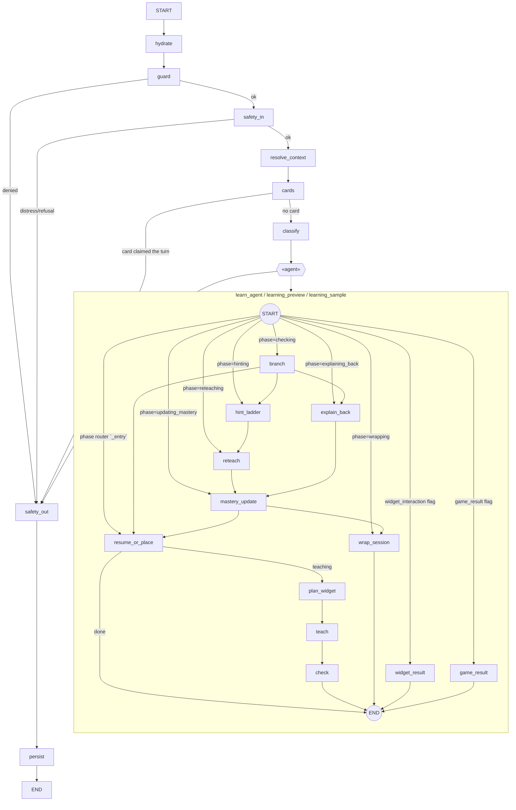

# Phase 0 — Recon

Read-only. No code changed in this phase. Every claim below carries `file:line`.

Baseline commit: `c0f9d62`, working tree dirty (31 modified files from prior in-flight
work — that work is left untouched and built upon).

---

## 0. The hard gate: PASSED, proceed

The brief says stop if the repository materially contradicts it — no LangGraph graph,
no learning agent node, or the KB not in Postgres. All three exist:

| Gate condition | Reality | Evidence |
|---|---|---|
| LangGraph graph | Yes, `StateGraph(AspireState)`, 8 top-level nodes | [main_graph.py:442](../backend/app/graph/main_graph.py#L442) |
| Learning agent node | Yes, a 12-node compiled subgraph registered 3× | [learn/graph.py:685](../backend/app/agents/learn/graph.py#L685) |
| KB in Postgres | Yes, 706 rows in `documents`, pgvector | verified live: `select count(*) from documents` → 706 |

Proceeding without pause. The divergences below are recorded, not treated as blockers.

---

## 1. Graph shape



Top-level nodes and edges: [main_graph.py:442-484](../backend/app/graph/main_graph.py#L442).
Learning subgraph nodes and edges: [learn/graph.py:707-762](../backend/app/agents/learn/graph.py#L707).
The subgraph's entry point is a **phase router** read off the checkpoint, not an
interrupt: [`_entry`, learn/graph.py:648](../backend/app/agents/learn/graph.py#L648).

**What can route into the learning agent.** `classify` picks one agent from the set the
access matrix granted ([classify.py:57-94](../backend/app/graph/nodes/classify.py#L57)).
`learn_agent` is described to the router as *"Teaching a money lesson step by step"*.
Three registered names, one graph: `learn_agent`, `learning_preview`, `learning_sample`
([learn/graph.py:835](../backend/app/agents/learn/graph.py#L835)).

**What can route out.** Exactly one edge: every agent node → `safety_out` →
`persist` → END ([main_graph.py:481-484](../backend/app/graph/main_graph.py#L481)).
`escalate_agent` is filtered out of the router's menu entirely
([classify.py:152 `UNROUTABLE`](../backend/app/graph/nodes/classify.py#L152)), so
**escalation cannot fire on a learning turn by router choice** — only via the
deterministic distress signal in `safety_in`. That satisfies the brief's escalation
constraint already; L9 will confirm it empirically.

---

## 2. The learning turn today: "What is compound interest?", HTTP → SSE bytes

1. `POST /v2/stream`, token decoded, band + locale onto the interceptor
   ([stream.py:131-142](../backend/app/api/stream.py#L131)).
2. Exact-question cache lookup ([stream.py:215](../backend/app/api/stream.py#L215)). Miss.
3. `graph.astream(payload, stream_mode=["messages","custom"])`
   ([stream.py:252](../backend/app/api/stream.py#L252)).
4. `hydrate` → `guard` → `safety_in` → `resolve_context` → `cards` → `classify`.
5. `classify` routes to `learn_agent` for a Stella/Orion caller.
6. **`resume_or_place`** ([learn/graph.py:111](../backend/app/agents/learn/graph.py#L111))
   calls `scheduler.place(book, band, mastery_rows, ...)`.
7. `plan_widget` → `teach` → `check`, one LLM call in `teach`.
8. `safety_out` gates the finished message; `persist` publishes the turn summary.
9. Tokens, then closing directives, then `done`
   ([stream.py:292-312](../backend/app/api/stream.py#L292)).

### LLM calls on this turn

| # | Node | Model (config key) | Prompt | Budget |
|---|---|---|---|---|
| 1 | `classify` | `classifier_model` = `openai:gpt-4o` ([config.py:273](../backend/app/config.py#L273)) | `_SYSTEM` [classify.py:109](../backend/app/graph/nodes/classify.py#L109) | one-line JSON |
| 2 | `plan_widget` | `classifier_model` via `default_invoke` ([learn/graph.py:819](../backend/app/agents/learn/graph.py#L819)) | `widgets/planner.py` | one primitive name |
| 3 | **`teach`** | `chat_model` = `openai:gpt-5.6-luna` ([config.py:74](../backend/app/config.py#L74)) | GLOBAL + persona card + `_SYSTEM` ([teach.py:132](../backend/app/agents/learn/teach.py#L132)) + optional `composition_prompt` | **`WORD_CAPS[band]` — 35 words at 5-8** |
| 4 | `safety_out` | `chat_model` (re-prompt) | shorten / vocab / chips / locale instruction | conditional |
| 5 | `persist` | `chat_model` | rolling summary | past `done` |

### Where the explanation gets lost — three named lines

**(a) [learn/graph.py:120](../backend/app/agents/learn/graph.py#L120) — `scheduler.place(...)`
never receives the utterance.**

```python
placement = scheduler.place(
    book, _band(state), rows,
    last_lesson_id=..., last_seen_at=..., covered_this_session=...,
)
```

There is no `utterance` parameter and no call site that reads the user's message before
placing. The lesson served is *the earliest unmastered lesson for the band*, whatever the
child asked. Ask "What is compound interest?" and you are taught lesson 1 of module 1,
"what saving is". **This is the reported symptom, stated exactly.** The turn does not
return a thin explanation of compound interest; it returns a competent explanation of a
different topic.

It is made worse by coverage: the curriculum is **one module, ten lessons, five concepts**
(`save`, `spend`, `goal`, + 2), all about saving
([content/module_01_saving.yaml](../backend/app/curriculum/content/module_01_saving.yaml);
live `select count(*) from concepts` → 5, `lessons` → 0). Compound interest is not in the
curriculum at all, at any band, so no amount of routing repair alone would reach it.

**(b) [teach.py:144](../backend/app/agents/learn/teach.py#L144) — the word cap is below the
brief's band minimum, and the prompt pushes below it again.**

```
- At most {cap} words. This is a hard limit and shorter is better.
```

`_cap` reads `safety_out.WORD_CAPS` ([safety_out.py:90](../backend/app/graph/nodes/safety_out.py#L90)):
`5-8 → 35`, `9-12 → 70`, `13-15 → 120`, `16-18 → 180`, `adult → None`. The brief asks for
40–90 words at 5-8 and 60–120 at 9-12. **35 is below the floor of the range the brief calls
a lesson**, and "shorter is better" is explicit instruction to undershoot it. A Stella turn
is *designed* to be three short sentences. That reads as "thin, generic" because it is
thin — deliberately, for reading stamina, but the trade was never reconciled against
"is this actually a lesson".

**(c) [teach.py:510-520](../backend/app/agents/learn/teach.py#L510) — prose and widget are
ONE model call, and the widget is emitted *inside* the prose.**

`_compose` makes a single `invoke(messages)` where `extra_instruction` is
`composition_prompt(...)`, which says
([planner.py:415](../backend/app/widgets/planner.py#L415)):

> `Emit ONE {kind} widget as JSON inside ⟦widget⟧ ... ⟦/widget⟧, inline in your reply, at the point it helps.`

Four consequences, each independently able to destroy the lesson:

1. **The budget is shared.** A few hundred characters of widget JSON and a 35-word prose
   allowance come out of one generation. The model trades prose away to fit the JSON.
2. **Forwarding stops at the opening sentinel.**
   [stream_interceptor.py:368-399](../backend/app/graph/stream_interceptor.py#L368): once
   `_widget is not None`, *nothing* is forwarded until `CLOSE` arrives. A model that opens
   the block early emits almost no prose before the stream goes quiet.
3. **An unterminated block silently eats everything after it.**
   [stream_interceptor.py:381-391](../backend/app/graph/stream_interceptor.py#L381) and
   [:443](../backend/app/graph/stream_interceptor.py#L443) — the buffer is discarded at the
   cap or at `flush()`. Every token between the stray `⟦widget⟧` and the end of the turn is
   gone. **This is the truncation the brief predicted, and it is real.**
4. **There is no floor.** `_compose` returns `None` only when `invoke` *raises* or returns
   an empty string ([teach.py:339-349](../backend/app/agents/learn/teach.py#L339)). A model
   that returns eight words returns eight words, and `authored_body` never runs.

**Bonus finding (not the reported bug, but a real one).** `safety_out` rewrites
`state["messages"]` ([safety_out.py:531-537](../backend/app/graph/nodes/safety_out.py#L531)),
but the tokens have already crossed the wire from `teach`, and `record.reply =
interceptor.prose` ([stream.py:318](../backend/app/api/stream.py#L318)) persists *what was
streamed*. So on the streaming path gates (a)–(f) change the checkpoint and the next turn's
history, **but not what the child read**. Logged as a finding; not repaired inside the
learning agent.

---

## 3. Widget path

| Component | Exists? | Evidence |
|---|---|---|
| Inline sentinel interceptor | **Yes** | [stream_interceptor.py:352-428](../backend/app/graph/stream_interceptor.py#L352), markers at [sentinel.py:40](../backend/app/widgets/sentinel.py#L40) |
| Widget schema module | Yes, 9 kinds + versions | [widgets/schemas.py](../backend/app/widgets/schemas.py) |
| Validator | Yes, **7 gates** | [widgets/validate.py](../backend/app/widgets/validate.py) |
| Planner (plan→compose split) | Yes | [widgets/planner.py:394](../backend/app/widgets/planner.py#L394) |
| Formula registry | Yes, 10 formulas + domain probe | [widgets/formulas/registry.py](../backend/app/widgets/formulas/registry.py) |
| Few-shots | Yes, 12 files | `app/widgets/fewshots/` |
| Cache | Yes | [widgets/cache.py](../backend/app/widgets/cache.py), table `concept_widgets` (0 rows) |
| Frontend renderer | Yes, versioned, error-bounded | [WidgetRenderer.tsx](../frontend/src/components/widgets/WidgetRenderer.tsx) |

**All nine primitives are implemented on the frontend**: `Allocator`, `Compare`,
`FlowDiagram`, `GrowthStack`, `Proportion`, `RevealCards`, `Simulator`, `SortBuckets`,
`Timeline`. The brief's Phase 9 ("implement whichever primitives are missing, first four
only") is **already complete** and needs re-verification, not construction.

**Answering the brief's direct question: yes, the inline sentinel path exists, and it is the
most likely cause of truncation exactly as predicted.** See §2(c).

Gate naming differs from the brief. Repo order is
`parse → schema → band → numeric → formula → copy → budget`
([validate.py:484](../backend/app/widgets/validate.py#L484)). The brief's `SANITISE` is
folded into `schema` (`SafeText` rejects markup/URLs/hex). The brief's `LOCALE` gate has
**no equivalent** — `GateContext.locale` is carried
([validate.py:82](../backend/app/widgets/validate.py#L82)) and never read. The brief's
`PROVENANCE` lives partly in the transport
([stream_interceptor.py:499 `WIDGET_AGENTS`](../backend/app/graph/stream_interceptor.py#L499))
rather than in the validator, and does not check `kind ∈ concept.widget_hints`.

---

## 4. Concepts

**A `concepts` table exists and is the wrong kind of thing.** Live schema:

```
concepts: id, name, band_min, band_max, module_id, vocabulary[]   -- 5 rows
```

([migration 0011](../backend/alembic/versions/20260805_0011_curriculum.py#L70)). It is a
*registry mirror of the YAML curriculum* — an id, a display name, a band range and the
words that concept introduces. It has **no teaching body, no check bank, no local example,
no misconceptions, no numeric anchors, no source KB ids, and no embedding.**

Teaching material lives in **authored YAML**
([curriculum/schema.py](../backend/app/curriculum/schema.py),
`content/module_01_saving.yaml`) — band-keyed `teach_points` and `examples`, with authored
`check_questions` and a 3-rung hint ladder. It is good material. There is one module of it.

So: **Phase 1 is the largest piece of work, as the brief anticipated.** The table name
collides, so the design decision is recorded here — extend `concepts` in place rather than
create a parallel table, because `mastery.concept_id` and `lessons.concept_id` are foreign
keys onto it and a second concept table would mean two answers to "what has this child
learned". Existing rows keep their ids (`save`, `spend`…) and gain `slug = id`; seeded rows
get `CON-####`. `concepts.module_id` is a NOT-NULL FK and must become nullable.

---

## 5. Learner state

Both tables exist and are written.

| Table | Rows | Writer |
|---|---|---|
| `learners` | 2 | `learning/mastery.py` |
| `mastery` (`learner_id, concept_id, score_0_3, last_seen, next_due, attempts, hinted_attempts, widget_touches`) | 2 | `mastery_update`, the **only** writer ([learn/graph.py:487](../backend/app/agents/learn/graph.py#L487)) |
| `sessions_learning` | 0 | nothing |
| `concept_widgets` | 0 | cache, never populated |

The mastery scale is already 0–3 with the brief's evidence kinds
(`CORRECT`, `CORRECT_AFTER_HINTS`, `WRONG`, `WIDGET`, `GAME`, `EXPLAINED`) and spaced
repetition via `next_due` ([learning/scheduler.py](../backend/app/learning/scheduler.py)).
**Phase 5's mastery rules are mostly already implemented** — the brief's non-negotiable
"widget interaction moves 0→1 and never higher" needs verifying against `Evidence.WIDGET`,
not building from scratch.

---

## 6. Retrieval

The learning agent uses **the same retriever as Q&A, deliberately**
([learn/graph.py:765 `_retrieve`](../backend/app/agents/learn/graph.py#L765) →
`qa/graph._search` → `app.rag` pgvector), dense-only, `k=4`, filtered by audience
([teach.py:121 `_AUDIENCE`](../backend/app/agents/learn/teach.py#L121)). One corpus, one
ingestion, one embedding model.

It retrieves against a query built from **the lesson**, not the utterance
([teach.py:402](../backend/app/agents/learn/teach.py#L402)):

```python
query = f"{lesson.objective} {lesson.concept_id.replace('_', ' ')}"
```

— which compounds §2(a): even the grounding never sees what the child asked.

There is **no in-memory numpy embedding matrix** to reuse. Retrieval is a pgvector round
trip per turn, with a Valkey-cached query embedding
([config.py:196-221](../backend/app/config.py#L196)). A second corpus therefore needs
its own approach; the brief's "mirror the existing Q&A retrieval pattern" means *reuse
`embed_query_cached` + a pgvector index*, not *copy a numpy matrix that does not exist*.

---

## 7. Prompt layering

**Already done, and done well.** `GLOBAL + PERSONA_CARD + AGENT_ROLE` is the cacheable
prefix; summary + last-N history sit below the breakpoint; retrieved chunks go in the human
turn ([prompting/builder.py:55-141](../backend/app/prompting/builder.py#L55)). Persona
cards are one file per persona in `app/prompting/personas/` and are shared across agents.

The learning agent **does** receive a persona card and **does** receive message history —
`_compose` passes `context=state.get("context")`
([teach.py:323](../backend/app/agents/learn/teach.py#L323)). Phase 6's prompt-layering work
is largely pre-satisfied. Full extracted prompt:
[learning/prompts/current_learn_system.txt](prompts/current_learn_system.txt).

---

## 8. Formula registry

Exists, with tests, and is enforced by gate 5.
[widgets/formulas/registry.py](../backend/app/widgets/formulas/registry.py):

`simple_interest`, `compound_interest`, `savings_goal_time`, `savings_goal_amount`,
`budget_split`, `inflation_erosion`, `currency_convert`, `loan_payment`, `percentage_of`,
`difference_over_time` — each a `FormulaSpec` with `band_min`, `parameters`, integer-cent
arithmetic via `Decimal`, and `probe_domain` evaluating at every corner and midpoint of the
control box. Tests: `tests/widgets/test_formulas.py`, plus a **frontend parity test**
`frontend/src/lib/widgets/formulas.parity.test.ts`.

---

## 9. SSE protocol

Event types: `token`, `directive`, `done`, `error`
([stream_interceptor.py:118](../backend/app/graph/stream_interceptor.py#L118)). Wire format
`event: <name>\ndata: <json>\n\n`, `ensure_ascii=False`.

Every content event carries a monotonic ordinal `i`; `error` deliberately does **not**
consume one ([stream_interceptor.py:574](../backend/app/graph/stream_interceptor.py#L574)).
Directive envelope: `{"i": n, "d": {...}}`, where `d.t` is the directive type.

Two directive channels: the graph's own `custom` stream via `get_stream_writer()`
(quick replies, citations, games, progress — already typed) and the **sentinel channel**
(widgets, parsed out of the token stream). The brief's ordinal-directive protocol means
moving widgets from the second channel to the first.

Frontend settled-block parser: `frontend/src/lib/stream/settled.ts` — paces reveal from its
own buffer rather than from packet arrival ([stream.py:367-374](../backend/app/api/stream.py#L367)).

---

## 10. Locale

`es` / `fr` are handled **only as an output-language instruction and a post-hoc check**.
There is no per-locale teaching content anywhere: curriculum YAML is English-only,
`for_band` has no locale dimension, and `Lesson.teach_points` is keyed by band alone.

`safety_out` gate (f) detects the reply's language by stopword frequency and re-prompts on a
mismatch ([safety_out.py:492-516](../backend/app/graph/nodes/safety_out.py#L492)). Game
seeds *are* localised (`app/games/seeds/{en,es,fr}`), so the pattern exists — it just was
never applied to lessons.

---

## What actually breaks the lesson

Ranked, with evidence.

### 1. The turn never learns what the child asked about. *(P0 — this is the reported bug)*

`resume_or_place` places by spaced-repetition schedule and band, never by utterance
([learn/graph.py:120](../backend/app/agents/learn/graph.py#L120)). Retrieval then queries on
the *placed lesson*, not the question ([teach.py:402](../backend/app/agents/learn/teach.py#L402)).
Both halves of the turn are blind to the topic. And with one authored module covering
saving, the topic asked about usually has no lesson to reach even if routing were fixed.

**This alone produces the exact report**: a turn that "mentions money" rather than teaching
the concept, with content that is "generic" because it is *about something else*.

### 2. Prose and widget compete inside one generation, and the widget can eat the prose.

One `invoke` produces both ([teach.py:510](../backend/app/agents/learn/teach.py#L510));
`composition_prompt` demands inline `⟦widget⟧` JSON
([planner.py:415](../backend/app/widgets/planner.py#L415)); the interceptor stops forwarding
at the opening marker and **discards everything buffered** if the block never closes
([stream_interceptor.py:381, :443](../backend/app/graph/stream_interceptor.py#L381)). A
malformed or unterminated widget truncates the lesson to whatever preceded the marker. The
brief predicted this mechanism; it is present verbatim.

### 3. There is no floor under prose quality — only under prose *existence*.

`_compose` falls back to `authored_body` only on exception or empty string
([teach.py:339-349](../backend/app/agents/learn/teach.py#L339)). No word-count check, no
substance check, no retry. Combined with a 35-word cap and a prompt saying "shorter is
better" ([teach.py:144](../backend/app/agents/learn/teach.py#L144)), the shortest acceptable
lesson is one sentence, and nothing in the system objects.

---

## Divergences from the brief (recorded, not blocking)

| Brief says | Repository is |
|---|---|
| BGE-M3 embeddings, 1024-dim | OpenAI `text-embedding-3-large`, **3072-dim** ([db/models.py:60](../backend/app/db/models.py#L60)) |
| Four bands (5-8, 9-12, 13-18, adult) | **Five**: `5-8, 9-12, 13-15, 16-18, adult` ([curriculum/schema.py:55](../backend/app/curriculum/schema.py#L55)) |
| Concept bodies `body_5_8 / 9_12 / 13_18 / adult` | Must map to the five-band ladder to match `WORD_CAPS`, `BAND_KINDS`, `vocab` |
| `concepts` table absent | Present, but a curriculum registry, not teaching material (§4) |
| Gates: PARSE SCHEMA NUMERIC BAND SANITISE LOCALE PROVENANCE | parse schema band numeric formula copy budget; no LOCALE gate; PROVENANCE split into the transport |
| Prompt layering to build | **Already built** ([prompting/builder.py](../backend/app/prompting/builder.py)) |
| Ship first four primitives | **All nine already shipped**, frontend and backend |
| In-memory numpy embedding matrix to mirror | Does not exist; retrieval is pgvector + a Valkey embedding cache |

**Model tiering is constrained by the project's access list.** Verified live via
`client.models.list()` — nine models, **no `-mini` variants**:
`gpt-4o`, `gpt-5.4-pro`, `gpt-5.5`, `gpt-5.5-pro`, `gpt-5.6-luna`, `gpt-5.6-sol`,
`gpt-5.6-terra`, `gpt-realtime-2.1-mini`, `text-embedding-3-large`. "Cheap/fast" therefore
means `gpt-4o`, not a mini.
